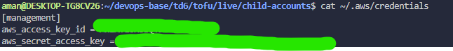

# TD6 : Environnements multiples avec AWS et multi-services avec Kubernetes

## Table des matières

1. [Préambule](#préambule)
2. [Partie 1 — Setup de multiples comptes avec AWS Accounts](#partie-1--setup-de-multiples-comptes-avec-aws-accounts)
3. [Partie 2 — Gérer les déploiements avec les workspaces OpenTofu](#partie-2--gérer-les-déploiements-avec-les-workspaces-opentofu)
4. [Partie 3 — Déploiement de microservices avec Kubernetes](#partie-3--déploiement-de-microservices-avec-kubernetes)
5. [Conclusion](#conclusion)

---

## Préambule

Ce TD a pour objectif de mettre en place une architecture multi-environnements réaliste en combinant AWS, OpenTofu et Kubernetes. Il aborde la création et la gestion de comptes AWS distincts (dev, stage, prod), l’utilisation des workspaces pour gérer les déploiements applicatifs, ainsi que le déploiement de microservices conteneurisés sur Kubernetes. L’ensemble permet d’illustrer une approche moderne et industrialisée du déploiement d’applications.

---

## Partie 1) Setup de multiples comptes avec AWS accounts

Dans cette partie, on va créer les différents environnements (prod, stage et dev).

L'approche choisie est plutôt celle proposée dans le repository de Brekkis, avec un tableau retournant les rôles créés et les ARNs associés.

### Création de l’arborescence

On crée les dossiers suivants :

```
mkdir td6
mkdir td6/tofu
mkdir td6/tofu/live
mkdir td6/tofu/live/child-accounts
```

### Fichier `main.tf`

On crée le fichier `main.tf` :

```
provider "aws" {
  region  = "us-east-2"
  profile = "management"
}

module "child_accounts" {
  source  = "brikis98/devops/book//modules/aws-organizations"
  version = "1.0.0"

  create_organization = true

  accounts = {
    development = "aman.ghazanfar+dev@edu.esiee.fr"
    staging     = "aman.ghazanfar+stage@edu.esiee.fr"
    production  = "aman.ghazanfar+prod@edu.esiee.fr"
  }
}
```

* **region** : région de création des comptes AWS (ici `us-east-2`, comme demandé dans le TD).
* **profile** : profil principal AWS, vérifiable avec :

```
cat ~/.aws/credentials
```



* **source** : module utilisé pour créer l’organisation AWS.
* Les comptes `development`, `staging` et `production` utilisent des adresses Gmail avec `+dev`, `+stage` et `+prod`, ce qui permet à AWS de reconnaître trois adresses distinctes.

### Fichier `outputs.tf`

On crée ensuite `outputs.tf` :

```
output "accounts" {
  description = "A map of accounts: {account_name = {id, iam_role_arn}}."
  value       = module.child_accounts.accounts
}
```

* `main.tf` définit et crée les ressources.
* `outputs.tf` expose les résultats (IDs et ARNs) pour pouvoir les réutiliser.

**En résumé : `main.tf` fait le travail, `outputs.tf` expose les résultats.**

### Initialisation et création

Initialisation du projet :

```
tofu init
```


Création de l’organisation et des comptes :

```
tofu apply
```


Résultat :


Les comptes sont bien créés et les identifiants sont sauvegardés.

### Configuration AWS locale

Ajout des profils dans `~/.aws/config` :


Les placeholders sont remplacés par les valeurs retournées par `tofu apply`.

Comme `credential_source` est défini à `Environment`, on définit les variables d’environnement dans WSL :


### Vérification des comptes

Commande de vérification :

```
AWS_PROFILE=dev-admin aws sts get-caller-identity
```


Même opération pour stage et prod :

```
AWS_PROFILE=stage-admin aws sts get-caller-identity
AWS_PROFILE=prod-admin aws sts get-caller-identity
```

Les environnements AWS sont prêts pour la suite du TD.

---

## Partie 2) Gérer les déploiements avec les workspaces OpenTofu

On récupère l’application Lambda du TD5 :

```
cp -r td5/scripts/tofu/live/lambda-sample td6/tofu/live/
```

Copie du module de test d’endpoint :

```
cp -r ./td5/scripts/tofu/modules/test-endpoint/ td6/tofu/modules
```

Suppression du backend distant :

```
rm -rf td6/tofu/live/lambda-sample/backend.tf
```

### Code Lambda

Modification du fichier `src/index.js` :

```js
exports.handler = (event, context, callback) => {
  callback(null, { statusCode: 200, body: `Hello from ${process.env.ENV_NAME}!` });
};
```

On configure ensuite les variables d’environnement dans `main.tf` :

```
environment_variables = {
  NODE_ENV = "production"
  ENV_NAME = terraform.workspace
}
```

`terraform.workspace` correspond au workspace actif.

### Création des workspaces

Positionnement dans le dossier :

```
cd td6/tofu/live/lambda-sample
```

Création des workspaces :

```
tofu workspace new development
tofu workspace new staging
tofu workspace new production
```


### Déploiements

Déploiement sur l’environnement de développement :

```
tofu workspace select development
AWS_PROFILE=dev-admin tofu apply
```


Résultat attendu :


Même logique pour staging :

```
tofu workspace select staging
AWS_PROFILE=stage-admin tofu apply
```


### Configuration par environnement

Création du dossier `config` :

```
mkdir src/config
```

Création des fichiers JSON (`development.json`, `staging.json`, `production.json`) :

```
{
  "text": "prod config"
}
```

Modification du handler :

```js
const config = require(`./config/${process.env.ENV_NAME}.json`)
exports.handler = (event, context, callback) => {
  callback(null, { statusCode: 200, body: `Hello from ${config.text}!` });
};
```

Redéploiement :

```
tofu workspace select development
AWS_PROFILE=dev-admin tofu apply
```

Résultat attendu :


### Nettoyage

Suppression des ressources :

```
tofu workspace select development
AWS_PROFILE=dev-admin tofu destroy

tofu workspace select staging
AWS_PROFILE=stage-admin tofu destroy

tofu workspace select production
AWS_PROFILE=prod-admin tofu destroy
```

---

## Partie 3) Déploiement de microservices avec Kubernetes

### Backend

Copie des sources :

```
cp -r td5/scripts/sample-app-frontend td5/scripts/sample-app-backend
```

Copie des fichiers Kubernetes :

```
cp td3/scripts/kubernetes/sample-app-deployment.yml td6/scripts/sample-app-backend/
cp td3/scripts/kubernetes/sample-app-service.yml td6/scripts/sample-app-backend/
```

Modification de `app.js` :

```js
app.get('/', (req, res) => {
  res.json({ text: "backend microservice" });
});
```

Mise à jour de `package.json` :

```json
{
  "name": "sample-app-backend",
  "version": "0.0.1",
  "description": "Backend app for 'DevOps Labs!'"
}
```

Configuration Kubernetes (`deployment` et `service`) puis build de l’image Docker :

```
npm run dockerize
```

L’image est bien créée :


Activation de Kubernetes sur Docker Desktop :


Déploiement sur Kubernetes :


Vérification des services :

```
kubectl get services
```


### Frontend

Copie des fichiers et configuration similaire au backend.

Modification de `app.js` :

```js
const backendHost = 'sample-app-backend-service';
app.get('/', async (req, res) => {
  const response = await fetch(`http://${backendHost}`);
  const responseBody = await response.json();
  res.render('hello', { name: responseBody.text });
});
```

Création du template `hello.ejs` :

```html
<p>Hello from <b><%= name %></b>!</p>
```

Build et déploiement du frontend :

```
npm run dockerize
kubectl apply -f sample-app-deployment.yml
kubectl apply -f sample-app-service.yml
```

Résultat final :


L’URL `http://localhost` pointe correctement vers l’application.

---

## Conclusion

Ce TD a permis de mettre en œuvre une chaîne complète de déploiement multi-environnements, depuis la création de comptes AWS jusqu’au déploiement de microservices sur Kubernetes. L’utilisation d’OpenTofu et des workspaces facilite la séparation des environnements, tandis que Kubernetes offre une solution robuste pour orchestrer des applications conteneurisées. Cette approche constitue une base solide pour des architectures DevOps modernes et évolutives.
